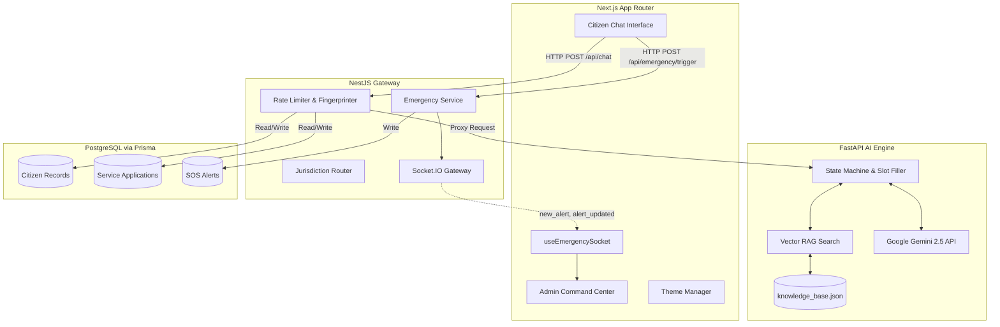
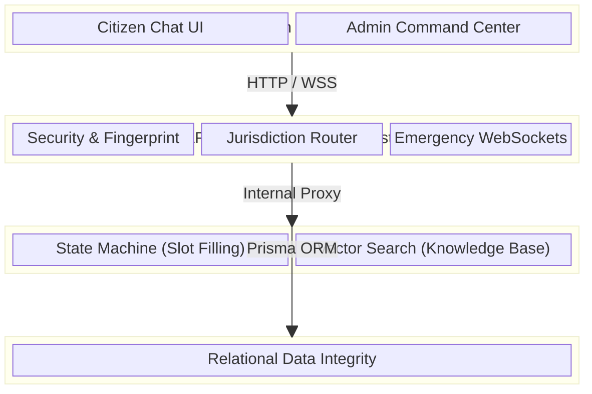
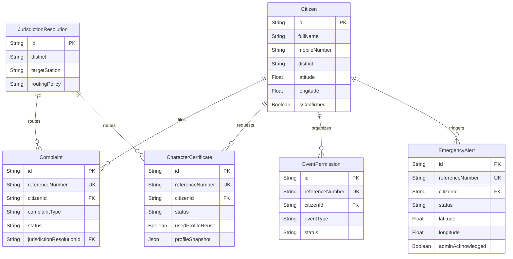
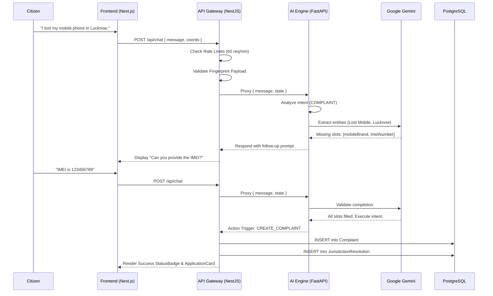
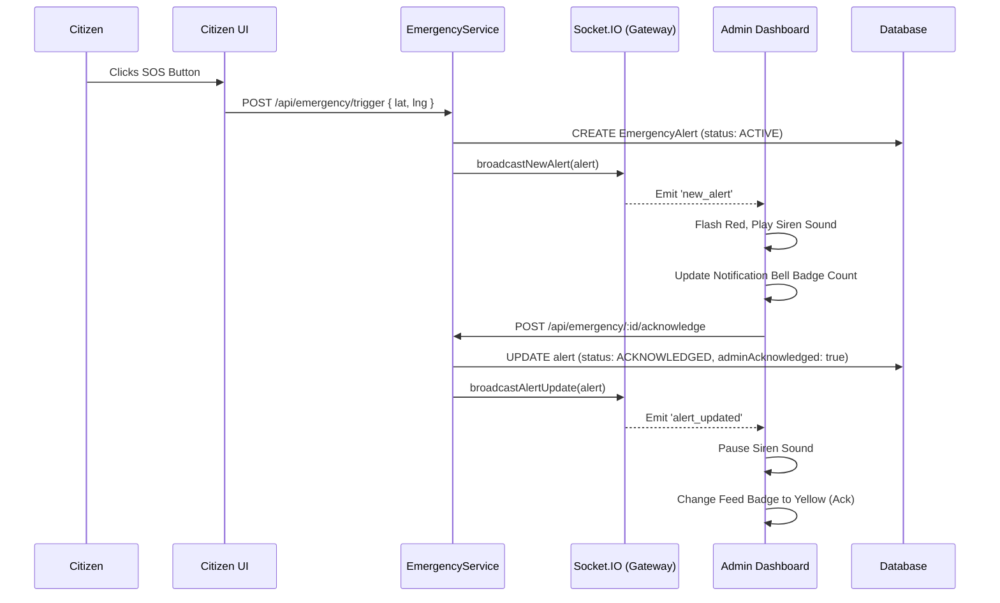

# RAKKU: Comprehensive Developer & Onboarding Guide

Welcome to the **RAKKU (Responsive Assistant for Knowledge, Kiosk & Citizen Utilities)** developer onboarding guide. This document provides an in-depth architectural breakdown, database models, API workflows, and system sequences to help you understand and contribute to the platform.

---

## 1. System Architecture Diagram



### 1.1 Architectural Layers Breakdown

RAKKU follows a strict multi-tiered architecture separating concerns into distinct logical layers:



#### 1. Presentation Layer (Frontend / Next.js)
- **Responsibility:** User interaction, accessibility, animation, and real-time state management.
- **Key Patterns:** Client-side rendering for interactivity (chat interface, map routing) and Server-Side Rendering (SSR) for initial load performance.
- **Core Modules:**
  - `ChatUI`: The primary conversational interface.
  - `Admin Dashboard`: Secure portal for police dispatchers to monitor SOS signals and view intelligence analytics.
  - `ThemeManager`: Manages Light/Dark modes seamlessly across the UI.

#### 2. API Gateway & Routing Layer (Backend / NestJS)
- **Responsibility:** Secure proxying, payload validation, database interactions, and real-time event broadcasting.
- **Key Patterns:** Decorator-based route handling, Dependency Injection, and Middleware.
- **Core Modules:**
  - `AuthGuard & Security`: Validates JWTs, enforces rate limiting, and manages deterministic fingerprinting to prevent spam.
  - `JurisdictionRouter`: Intelligently routes verified complaints to the correct out of 75 UP districts.
  - `EmergencyGateway`: Maintains WebSocket connections to instantly broadcast `new_alert` events.

#### 3. AI & Business Logic Layer (FastAPI)
- **Responsibility:** Intent classification, slot-filling, semantic search, and generative response formulation.
- **Key Patterns:** Stateless request handling, State Machine execution, and Vector embeddings.
- **Core Modules:**
  - `WorkflowEngine`: A robust state machine that identifies missing information (e.g., IMEI number) and prompts the user until a workflow is complete.
  - `RAGEngine (Retrieval-Augmented Generation)`: Queries `knowledge_base.json` to ground LLM responses in factual policy data.
  - `Gemini Integration`: Interfaces with Google Gemini 2.5 Flash for natural language understanding and generation.

#### 4. Data Access & Persistence Layer (Prisma & PostgreSQL)
- **Responsibility:** Long-term storage, relational data integrity, and complex queries.
- **Key Patterns:** Object-Relational Mapping (ORM) and strongly-typed queries.
- **Core Modules:**
  - `Prisma Client`: Used by NestJS to perform CRUD operations on `Citizen`, `Complaint`, and `EmergencyAlert` tables.
  - `Database Trigger/Events`: Handles timestamps, cascades, and status enum constraints.

---

## 2. Database Entity-Relationship (ER) Diagram

RAKKU uses Prisma ORM connected to a PostgreSQL/Supabase database. Below is the simplified ER diagram of the core models.



---

## 3. Core Workflows (Sequence Diagrams)

### 3.1 The Standard Chat & Service Request Flow

When a citizen converses with Inspector Rakku to file a complaint, the system utilizes a slot-filling AI state machine.



### 3.2 Real-Time Emergency (SOS) Flow

RAKKU features a real-time Command Center for dispatchers, built entirely on WebSockets.



---

## 4. Advanced System Features

### 4.1 Profile Reuse Protocol (PRP)
The Profile Reuse Protocol (`handleProfileReuseProtocol`) minimizes friction for returning citizens. 
1. **Lookup**: When a verified citizen starts a flow (like an Event Permission), the system retrieves their `Citizen` record.
2. **Mapping**: The frontend automatically pre-fills fields (e.g., Organizer Name, Address) based on the profile.
3. **Snapshot Isolation**: The database takes a `profileSnapshot` (JSON) of the citizen at the time of submission, isolating the record from future profile updates.
4. **Accessibility**: Screen readers utilize `Announcements.announce` to voice out: "Form pre-filled using your verified profile."

### 4.2 Admin Intelligence Hub
Located at `/admin`, this is a fully responsive React Component (`AdminIntelligenceView.tsx`) that:
- Reads nightly aggregated DB queries (Sentiments, Workflows).
- Embeds charts and dynamic metrics.
- Seamlessly respects the user's `dark:` Tailwind preferences.
- Exists in the same layout as the live `EmergencyAlertsWidget.tsx`, guaranteeing admins never miss an SOS while reading analytics.

### 4.3 Multi-Tier Security & Abuse Protection
1. **Rate Limiting**: `express-rate-limit` enforces 60 requests/minute globally, and stricter 15 requests/minute for heavy AI inference routes.
2. **Payload Protection**: Express JSON limiters cap payloads at 1MB to prevent DOS attacks.
3. **Fingerprinting**: Every database mutation (like filing a complaint) hashes the request body and user IP to generate a SHA256 deterministic hash. NestJS throws a `409 Conflict` if the same hash is submitted within a 5-minute window.

---

## 5. Setup & Execution

### Option A: Docker Compose (Recommended)
This spins up the Database, Frontend, NestJS Backend, and FastAPI AI layer simultaneously.
```bash
docker compose up --build
```

### Option B: Local Microservices
If you need to debug specific layers:

**1. Database & Backend (NestJS)**
```bash
cd backend
npm install
npx prisma generate
npx prisma db push
npm run start:dev
```

**2. Frontend (Next.js)**
```bash
cd frontend
npm install
npm run dev
```

**3. AI Engine (FastAPI)**
```bash
cd ai-service
pip install -r requirements.txt
uvicorn main:app --reload --port 8000
```

---

## 6. Testing (Master Test Framework)

RAKKU enforces a rigorous **Master Test Framework (MTF)** to guarantee system reliability. Tests span unit, integration, and parity checks.

To execute the entire MTF:
```bash
# Windows (PowerShell)
.\run_all_tests.ps1

# Linux/Mac
./scripts/run_all_tests.sh
```

**Parity Guarantee:**
RAKKU strictly tests language parity. For example, the intent for triggering an emergency MUST correctly fire whether the user types:
- "I need help" (English)
- "मुझे मदद चाहिए" (Hindi)
- "Emergency hai" (Hinglish)

*End of Guide*
